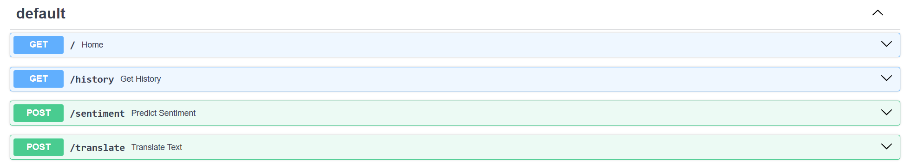
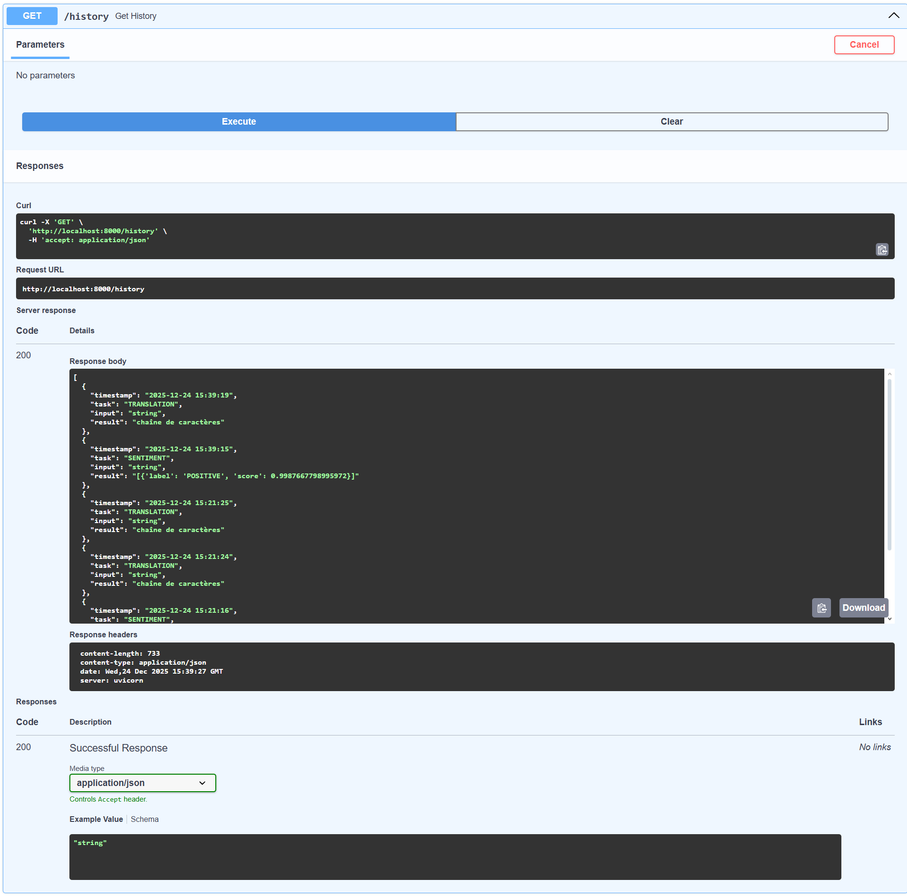

# NLP Inference Microservice


A production-ready REST API for multi-task Natural Language Processing. This service acts as a unified gateway for multiple Transformer models, providing **Sentiment Analysis** and **English-to-French Translation**. It features an automated logging system for request auditing.



## Overview

Instead of deploying separate containers for each model, this microservice loads them into a single efficient memory space. It is designed for ease of deployment, monitoring, and scalability.

**Key Features:**
- **Multi-Model Architecture:** Runs `DistilBERT` (Sentiment) and `Helsinki-NLP` (Translation) simultaneously.
- **Request Logging:** Automatically saves all inputs, outputs, and timestamps to local logs.
- **High Performance:** Models are pre-loaded at startup to ensure low-latency inference.
- **Validation:** Strict data validation using Pydantic schemas.

## Tech Stack

- **Core:** Python 3.9, FastAPI, Uvicorn
- **ML Backend:** PyTorch, Transformers, SentencePiece
- **Models:**
    - `distilbert-base-uncased-finetuned-sst-2-english`
    - `Helsinki-NLP/opus-mt-en-fr`
- **DevOps:** Docker

## Project Structure

```text
.
├── Dockerfile           # Container configuration
├── main.py              # App entry point & Logic
├── requirements.txt     # Dependencies
├── logs/                # Auto-generated log storage
│   └── service_history.log
└── Images/              # Documentation assets
```

## Installation and Setup

### Local Development

1. **Clone the repository:**
   ```bash
   git clone <repository-url>
   cd nlp-inference-service
   ```

2. **Install dependencies:**
   ```bash
   pip install -r requirements.txt
   ```
   *Note: `sentencepiece` is required for the translation tokenizer.*

3. **Run the server:**
   ```bash
   python -m uvicorn main:app --reload --host 0.0.0.0 --port 8000
   ```
   *First launch will take a moment to download the models from Hugging Face.*

### Docker Deployment

1. **Build the image:**
   ```bash
   docker build -t nlp-service .
   ```

2. **Run the container:**
   ```bash
   docker run -d -p 8000:8000 --name nlp-app nlp-service
   ```

## API Documentation

The API comes with auto-generated interactive documentation available at `/docs`.

### 1. Health Check
**GET** `/`
Returns the status of the service and lists available endpoints.

### 2. Sentiment Analysis
**POST** `/sentiment`
Determines if a text is POSITIVE or NEGATIVE.

**Request:**
```json
{
  "text": "The deployment process was incredibly smooth."
}
```

**Response:**
```json
{
  "result": [
    {
      "label": "POSITIVE",
      "score": 0.9998
    }
  ]
}
```

### 3. Translation (En → Fr)
**POST** `/translate`
Translates English text into French using the Opus-MT model.

**Example Request:**
```json
{
  "text": "Hello world, this is a test."
}
```

**Example Response:**
```json
{
  "translated_text": "Bonjour le monde, c'est un test."
}
```


## Logging System

The service includes a built-in logger that tracks usage statistics in real-time. Every request is timestamped and saved to `logs/service_history.log`.

**Log Format:**
`[YYYY-MM-DD HH:MM:SS] TASK: <TYPE> | INPUT: <TEXT> | OUTPUT: <RESULT>`

**Example Log Output:**
```text
[2025-12-24 09:33:57] TASK: SENTIMENT | INPUT: Great job! | OUTPUT: [{'label': 'POSITIVE', 'score': 0.99}]
[2025-12-24 09:34:05] TASK: TRANSLATION | INPUT: Hello | OUTPUT: Bonjour
```



## License

**MIT License**

Copyright (c) 2025 Andriy Vlonha

Permission is hereby granted, free of charge, to any person obtaining a copy
of this software and associated documentation files (the "Software"), to deal
in the Software without restriction, including without limitation the rights
to use, copy, modify, merge, publish, distribute, sublicense, and/or sell
copies of the Software, and to permit persons to whom the Software is
furnished to do so, subject to the following conditions:

The above copyright notice and this permission notice shall be included in all
copies or substantial portions of the Software.