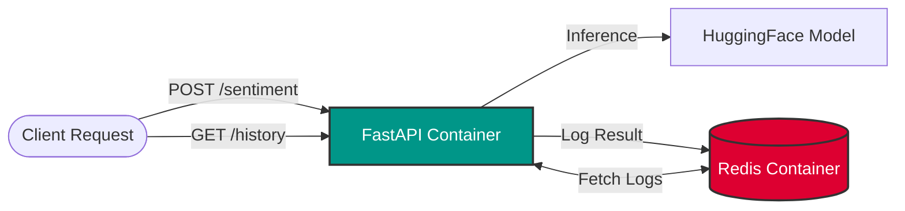

# NLP Inference Microservice (Docker Compose & Redis)


A production-ready **Microservices Architecture** for Natural Language Processing.  
This project orchestrates multiple containers using **Docker Compose**: a FastAPI application for inference and a **Redis** database for high-speed logging and persistence.


---

## Architecture & Workflow

This project demonstrates a modern microservices approach. Instead of a monolithic script, the system decouples inference from data persistence.



### Key Features

- **Microservices Orchestration:** Fully dockerized environment via `docker-compose`
- **Multi-Model Inference:** `DistilBERT` (Sentiment) & `Helsinki-NLP` (Translation)
- **Persistent Storage:** Asynchronous logging to Redis
- **Request History:** Dedicated endpoint for audit and debugging
- **Strict Validation:** Pydantic schemas enforce type safety

---

## Tech Stack

- **Orchestration:** Docker Compose
- **Core:** Python 3.9, FastAPI, Uvicorn
- **Database:** Redis (Alpine)
- **ML Backend:** PyTorch, Transformers, SentencePiece
- **Models:**
  - `distilbert-base-uncased-finetuned-sst-2-english`
  - `Helsinki-NLP/opus-mt-en-fr`

---

## Project Structure

```
.
├── docker-compose.yml   # Service orchestration (App + Redis)
├── Dockerfile           # App container configuration
├── main.py              # Application logic & endpoints
├── requirements.txt     # Python dependencies
└── Images/              # Documentation assets
```

---

## Installation and Setup

### Prerequisites
- Docker Engine
- Docker Compose

### Quick Start

1. **Clone the repository**
```bash
git clone https://github.com/Western-1/nlp-inference-service
cd nlp-inference-service
```

2. **Start the services**
```bash
docker-compose up --build
```

> [!NOTE]
> The first launch may take several minutes while ML models are downloaded from Hugging Face.

3. **Stop the system**
```bash
docker-compose down
```

---

## API Documentation

Interactive Swagger UI is available at: `http://localhost:8000/docs`

### 1. Health Check
`GET /` - Checks service status and Redis connection.

### 2. Request History
`GET /history` - Returns the last 10 requests stored in Redis.

```json
[
  {
    "timestamp": "2025-12-24 18:30:00",
    "task": "TRANSLATION",
    "input": "Hello",
    "result": "Bonjour"
  }
]
```

### 3. Sentiment Analysis
`POST /sentiment` -  Classifies text as **POSITIVE** or **NEGATIVE**.

**Request**
```json
{
  "text": "The deployment process was incredibly smooth."
}
```

**Response**
```json
{
  "result": [
    {
      "label": "POSITIVE",
      "score": 0.9998
    }
  ]
}
```

### 4. Translation (En → Fr)
`POST /translate`  
Translates English text to French.

**Request**
```json
{
  "text": "Hello world, this is a test."
}
```

**Response**
```json
{
  "translated_text": "Bonjour le monde, c'est un test."
}
```


---

## Logging Architecture

Instead of synchronous file logging, the service uses **Redis Lists** as a high‑performance buffer.

1. __API__ receives a request  
2. Model generates a prediction  
3. Result is serialized to __JSON__ and pushed to `service_history`  
4. `/history` endpoint retrieves recent entries via `LRANGE`


---

## License

**MIT License**

Copyright (c) 2025 Andriy Vlonha

Permission is hereby granted, free of charge, to any person obtaining a copy of this software and associated documentation files (the "Software"), to deal in the Software without restriction, including without limitation the rights to use, copy, modify, merge, publish, distribute, sublicense, and/or sell copies of the Software, and to permit persons to whom the Software is furnished to do so, subject to the following conditions:

The above copyright notice and this permission notice shall be included in all copies or substantial portions of the Software.
